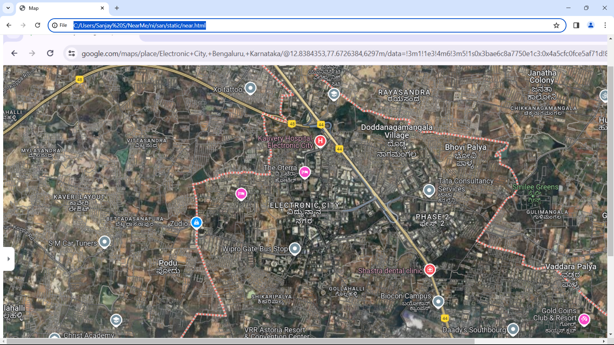
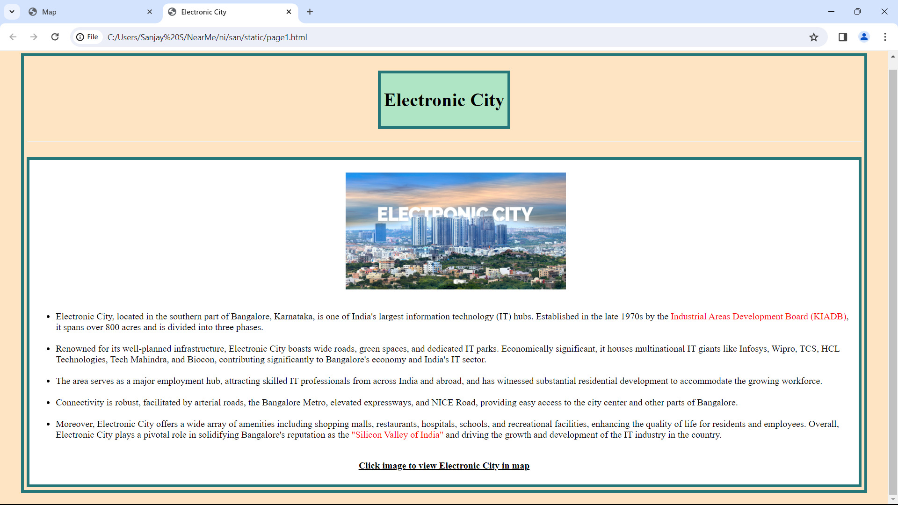
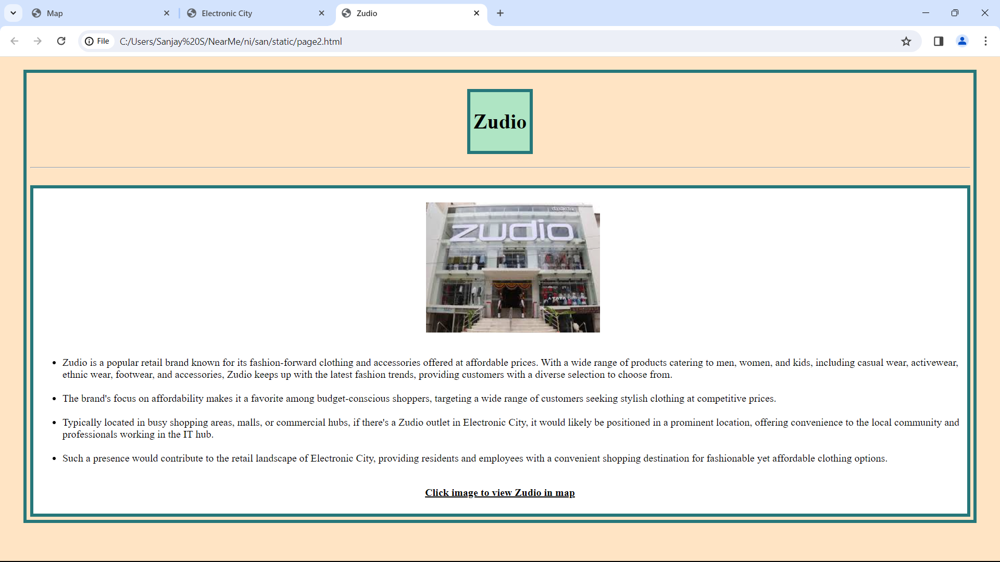
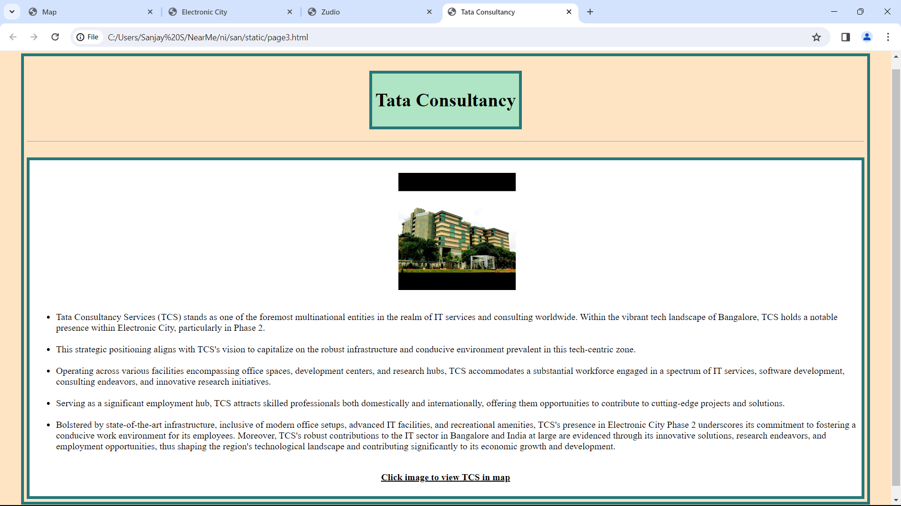
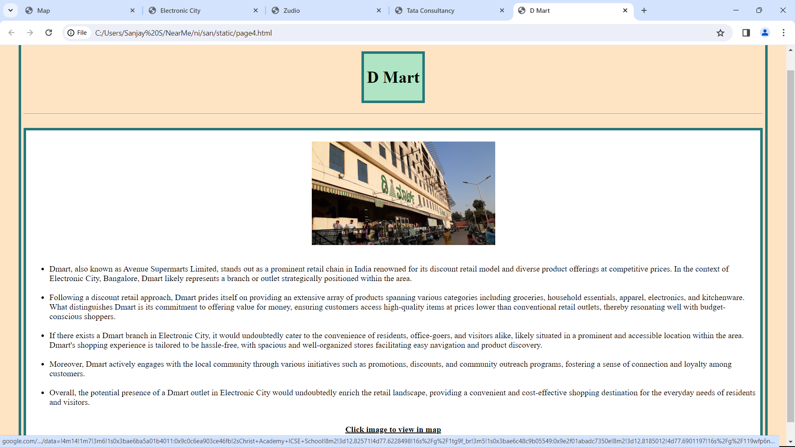
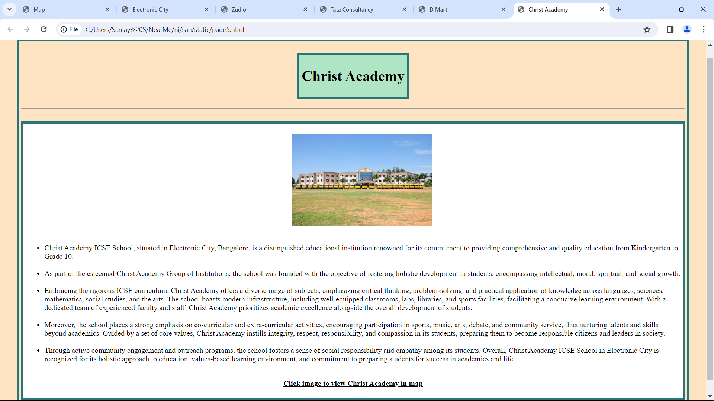

# Ex04 Places Around Me
## Date : 05/04/2024 

## AIM
To develop a website to display details about the places around my house.

## DESIGN STEPS

### STEP 1
Create a Django admin interface.

### STEP 2
Download your city map from Google.

### STEP 3
Using ```<map>``` tag name the map.

### STEP 4
Create clickable regions in the image using ```<area>``` tag.

### STEP 5
Write HTML programs for all the regions identified.

### STEP 6
Execute the programs and publish them.

## CODE
### Near
```html
<!DOCTYPE html>
<html lang="en">
<head>
    <meta charset="UTF-8">
    <meta name="viewport" content="width=device-width, initial-scale=1.0">
    <title>Map</title>
</head>
<body><center>
    <h2>Electronic City</h2>
    
    <map name="image-map">
    <area target="_blank" alt="Electronic City" title="Electronic City" href="page1.html" coords="660,520,845,427" shape="rect">
    <area target="_blank" alt="Zudio" title="Zudio" href="page2.html" coords="448,533,522,478" shape="rect">
    <area target="_blank" alt="Tata Consultancy" title="Tata Consultancy" href="page3.html" coords="1042,461,1219,392" shape="rect">
    <area target="_blank" alt="D Mart" title="D Mart" href="page4.html" coords="1205,949,1286,902" shape="rect">
    <area target="_blank" alt="Christ Academy" title="Christ Academy" href="page5.html" coords="108,837,289,776" shape="rect">
</map>
    </center>
</body>
</html>
```

### Place 1
```html
<!DOCTYPE html>
<html lang="en">
<head>
    <meta charset="UTF-8">
    <meta name="viewport" content="width=device-width, initial-scale=1.0">
    <title>Electronic City</title>
    <link rel="stylesheet" href="san1.css">
</head>
<body class="alb">
    <div class="adiv">
        <div class="box">
            <h1 class="h">Electronic City</h1>
        </div>
        <hr>
        <br>
        <div class="aldiv">  
            <ul>
                <a href="https://www.google.com/maps/place/Electronic+City,+Bengaluru,+Karnataka/@12.8379167,77.6329979,13z/data=!4m15!1m8!3m7!1s0x3bae6c8a7750e1c3:0x4a5cfc0fce5af71d!2sElectronic+City,+Bengaluru,+Karnataka!3b1!8m2!3d12.8452145!4d77.6601695!16zL20vMDIzbGMx!3m5!1s0x3bae6c8a7750e1c3:0x4a5cfc0fce5af71d!8m2!3d12.8452145!4d77.6601695!16zL20vMDIzbGMx?entry=ttu">
                    
                </a>
                <br><br>
                <li>Electronic City, located in the southern part of Bangalore, Karnataka, is one of India's largest information technology (IT) hubs. Established in the late 1970s by the <span class="alsp">Industrial Areas Development Board (KIADB)</span>, it spans over 800 acres and is divided into three phases.</li>
                <br>
                <li>Renowned for its well-planned infrastructure, Electronic City boasts wide roads, green spaces, and dedicated IT parks. Economically significant, it houses multinational IT giants like Infosys, Wipro, TCS, HCL Technologies, Tech Mahindra, and Biocon, contributing significantly to Bangalore's economy and India's IT sector.</li>
                <br>
                <li>The area serves as a major employment hub, attracting skilled IT professionals from across India and abroad, and has witnessed substantial residential development to accommodate the growing workforce.</li>
                <br>
                <li>Connectivity is robust, facilitated by arterial roads, the Bangalore Metro, elevated expressways, and NICE Road, providing easy access to the city center and other parts of Bangalore.</li>
                <br>
                <li>Moreover, Electronic City offers a wide array of amenities including shopping malls, restaurants, hospitals, schools, and recreational facilities, enhancing the quality of life for residents and employees. Overall, Electronic City plays a pivotal role in solidifying Bangalore's reputation as the <span class="alsp">"Silicon Valley of India"</span> and driving the growth and development of the IT industry in the country.</li>
            </ul>
            <br>
            <center><b><u>Click image to view Electronic  City in map</u></b></center>
            <br>
        </div>
    </div>
</body>
</html>
```

### Place 2
```html
<!DOCTYPE html>
<html lang="en">
<head>
    <meta charset="UTF-8">
    <meta name="viewport" content="width=device-width, initial-scale=1.0">
    <title>Zudio</title>
    <link rel="stylesheet" href="san1.css">
</head>
<body class="alb">
    <div class="adiv">
        <div class="box">
            <h1 class="h">Zudio</h1>
        </div>
        <hr>
        <br>
        <div class="aldiv">  
            <ul>
                <a href="https://www.google.com/maps/place/Zudio/@12.8428102,77.6376592,14.5z/data=!4m6!3m5!1s0x3bae6b78585f0b37:0xb35bf211cad6f064!8m2!3d12.842672!4d77.6440796!16s%2Fg%2F11rf7ty3yj?entry=ttu">
                    
                </a>
                <br><br>
                <li>Zudio is a popular retail brand known for its fashion-forward clothing and accessories offered at affordable prices. With a wide range of products catering to men, women, and kids, including casual wear, activewear, ethnic wear, footwear, and accessories, Zudio keeps up with the latest fashion trends, providing customers with a diverse selection to choose from. </li>
                <br>
                <li>The brand's focus on affordability makes it a favorite among budget-conscious shoppers, targeting a wide range of customers seeking stylish clothing at competitive prices. </li>
                <br>
                <li>Typically located in busy shopping areas, malls, or commercial hubs, if there's a Zudio outlet in Electronic City, it would likely be positioned in a prominent location, offering convenience to the local community and professionals working in the IT hub.</li>
                <br>
                <li> Such a presence would contribute to the retail landscape of Electronic City, providing residents and employees with a convenient shopping destination for fashionable yet affordable clothing options.</li>
            </ul>
            <br>
            <center><b><u>Click image to view Zudio in map</u></b></center>
            <br>
        </div>
    </div>
</body>
</html>
```

### Place 3
```html
<!DOCTYPE html>
<html lang="en">
<head>
    <meta charset="UTF-8">
    <meta name="viewport" content="width=device-width, initial-scale=1.0">
    <title>Tata Consultancy</title>
    <link rel="stylesheet" href="san1.css">
</head>
<body class="alb">
    <div class="adiv">
        <div class="box">
            <h1 class="h">Tata Consultancy</h1>
        </div>
        <hr>
        <br>
        <div class="aldiv">  
            <ul>
                <a href="https://www.google.com/maps/place/Tata+Consultancy+Services/@12.8428102,77.6376592,14.5z/data=!4m6!3m5!1s0x3bae6ced0c610db3:0x804aa662b8d221a9!8m2!3d12.847438!4d77.6789574!16s%2Fg%2F1vf99t8d?entry=ttu">
                    
                </a>
                <br><br>
                <li>Tata Consultancy Services (TCS) stands as one of the foremost multinational entities in the realm of IT services and consulting worldwide. Within the vibrant tech landscape of Bangalore, TCS holds a notable presence within Electronic City, particularly in Phase 2. </li>
                <br>
                <li>This strategic positioning aligns with TCS's vision to capitalize on the robust infrastructure and conducive environment prevalent in this tech-centric zone. </li>
                <br>
                <li>Operating across various facilities encompassing office spaces, development centers, and research hubs, TCS accommodates a substantial workforce engaged in a spectrum of IT services, software development, consulting endeavors, and innovative research initiatives. </li>
                <br>
                <li>Serving as a significant employment hub, TCS attracts skilled professionals both domestically and internationally, offering them opportunities to contribute to cutting-edge projects and solutions.</li>
                <br>
                <li>Bolstered by state-of-the-art infrastructure, inclusive of modern office setups, advanced IT facilities, and recreational amenities, TCS's presence in Electronic City Phase 2 underscores its commitment to fostering a conducive work environment for its employees. Moreover, TCS's robust contributions to the IT sector in Bangalore and India at large are evidenced through its innovative solutions, research endeavors, and employment opportunities, thus shaping the region's technological landscape and contributing significantly to its economic growth and development.</li>
            </ul>
            <br>
            <center><b><u>Click image to view TCS in map</u></b></center>
            <br>
        </div>
    </div>
</body>
</html>
```

### Place 4
```html
<!DOCTYPE html>
<html lang="en">
<head>
    <meta charset="UTF-8">
    <meta name="viewport" content="width=device-width, initial-scale=1.0">
    <title>D Mart</title>
    <link rel="stylesheet" href="san1.css">
</head>
<body class="alb">
    <div class="adiv">
        <div class="box">
            <h1 class="h">D Mart</h1>
        </div>
        <hr>
        <br>
        <div class="aldiv">  
            <ul>
                <a href="https://www.google.com/maps/place/DMart/@12.8345084,77.6651276,14z/data=!4m14!1m7!3m6!1s0x3bae6ba5a01b4011:0x9c0c6ea903ce46fb!2sChrist+Academy+ICSE+School!8m2!3d12.82571!4d77.6228498!16s%2Fg%2F1tg9f_br!3m5!1s0x3bae6c48c9b05549:0x9e2f01abadc7350e!8m2!3d12.8185012!4d77.6901197!16s%2Fg%2F119wfp6nh?entry=ttu">
                    
                </a>
                <br><br>
                <li>Dmart, also known as Avenue Supermarts Limited, stands out as a prominent retail chain in India renowned for its discount retail model and diverse product offerings at competitive prices. In the context of Electronic City, Bangalore, Dmart likely represents a branch or outlet strategically positioned within the area. </li>
                <br>
                <li>Following a discount retail approach, Dmart prides itself on providing an extensive array of products spanning various categories including groceries, household essentials, apparel, electronics, and kitchenware. What distinguishes Dmart is its commitment to offering value for money, ensuring customers access high-quality items at prices lower than conventional retail outlets, thereby resonating well with budget-conscious shoppers. </li>
                <br>
                <li> If there exists a Dmart branch in Electronic City, it would undoubtedly cater to the convenience of residents, office-goers, and visitors alike, likely situated in a prominent and accessible location within the area. Dmart's shopping experience is tailored to be hassle-free, with spacious and well-organized stores facilitating easy navigation and product discovery.</li>
                <br>
                <li> Moreover, Dmart actively engages with the local community through various initiatives such as promotions, discounts, and community outreach programs, fostering a sense of connection and loyalty among customers.  </li>
                <br>
                <li> Overall, the potential presence of a Dmart outlet in Electronic City would undoubtedly enrich the retail landscape, providing a convenient and cost-effective shopping destination for the everyday needs of residents and visitors.</li>
            </ul>
            <br>
            <center><b><u>Click image to view     in map</u></b></center>
            <br>
        </div>
    </div>
</body>
</html>
```

### Place 5
```html
<!DOCTYPE html>
<html lang="en">
<head>
    <meta charset="UTF-8">
    <meta name="viewport" content="width=device-width, initial-scale=1.0">
    <title>Christ Academy</title>
    <link rel="stylesheet" href="san1.css">
</head>
<body class="alb">
    <div class="adiv">
        <div class="box">
            <h1 class="h">Christ Academy</h1>
        </div>
        <hr>
        <br>
        <div class="aldiv">  
            <ul>
                <a href="https://www.google.com/maps/place/Christ+Academy+ICSE+School/@12.8500581,77.6444204,13.66z/data=!4m6!3m5!1s0x3bae6ba5a01b4011:0x9c0c6ea903ce46fb!8m2!3d12.82571!4d77.6228498!16s%2Fg%2F1tg9f_br?entry=ttu">
                    
                </a>
                <br><br>
                <li>Christ Academy ICSE School, situated in Electronic City, Bangalore, is a distinguished educational institution renowned for its commitment to providing comprehensive and quality education from Kindergarten to Grade 10.</li>
                <br>
                <li>As part of the esteemed Christ Academy Group of Institutions, the school was founded with the objective of fostering holistic development in students, encompassing intellectual, moral, spiritual, and social growth. </li>
                <br>
                <li> Embracing the rigorous ICSE curriculum, Christ Academy offers a diverse range of subjects, emphasizing critical thinking, problem-solving, and practical application of knowledge across languages, sciences, mathematics, social studies, and the arts. The school boasts modern infrastructure, including well-equipped classrooms, labs, libraries, and sports facilities, facilitating a conducive learning environment. With a dedicated team of experienced faculty and staff, Christ Academy prioritizes academic excellence alongside the overall development of students.</li>
                <br>
                <li> Moreover, the school places a strong emphasis on co-curricular and extra-curricular activities, encouraging participation in sports, music, arts, debate, and community service, thus nurturing talents and skills beyond academics. Guided by a set of core values, Christ Academy instills integrity, respect, responsibility, and compassion in its students, preparing them to become responsible citizens and leaders in society. </li>
                <br>
                <li> Through active community engagement and outreach programs, the school fosters a sense of social responsibility and empathy among its students. Overall, Christ Academy ICSE School in Electronic City is recognized for its holistic approach to education, values-based learning environment, and commitment to preparing students for success in academics and life.</li>
            </ul>
            <br>
            <center><b><u>Click image to view Christ Academy in map</u></b></center>
            <br>
        </div>
    </div>
</body>
</html>
```

### External CSS
```css
.alb {
    background-color: #ffe4c4;
}
.h {
    text-align: center;
}
.adiv {
    width: 95%;
    height: fit-content;
    border: 5px solid rgb(38, 119, 122);
    margin: 20px auto;
    padding: 5px;
}
.box {
    width: fit-content;
    height: fit-content;
    border: 5px solid rgb(38, 119, 122);
    margin: 20px auto;
    padding: 5px;
    background-color: #afe5c4;
}
.aldiv {
    width: fit-content;
    border: 5px solid rgb(38, 119, 122);
    padding: 5px;
    background-color: rgb(255, 255, 255);
}
.alsp {
    color: #f70000;
}
.img {
    width: fit-content;
    height: 200px;
    display: block;
    margin: 0 auto;
}
```

## OUTPUT
### Near out


### E-City out


### Zudio out


### TCS out


### D Mart out


### Christ Academy out


## RESULT
The program for implementing image maps using HTML is executed successfully.
